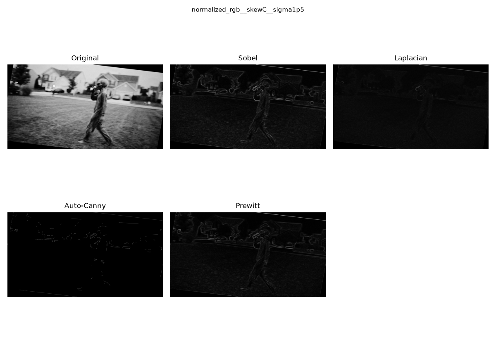
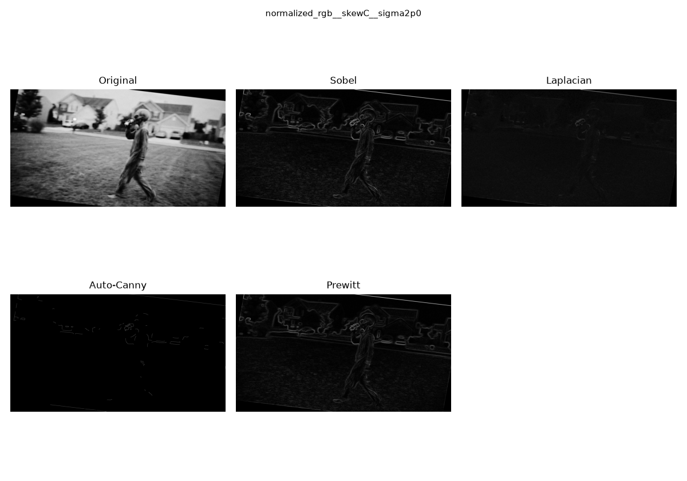
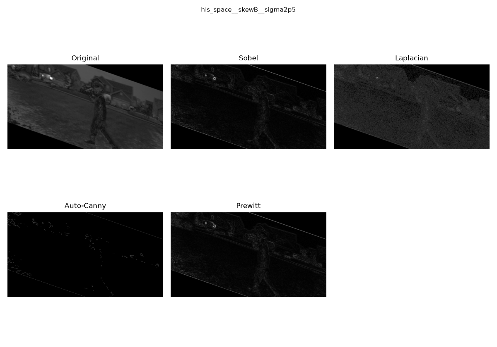
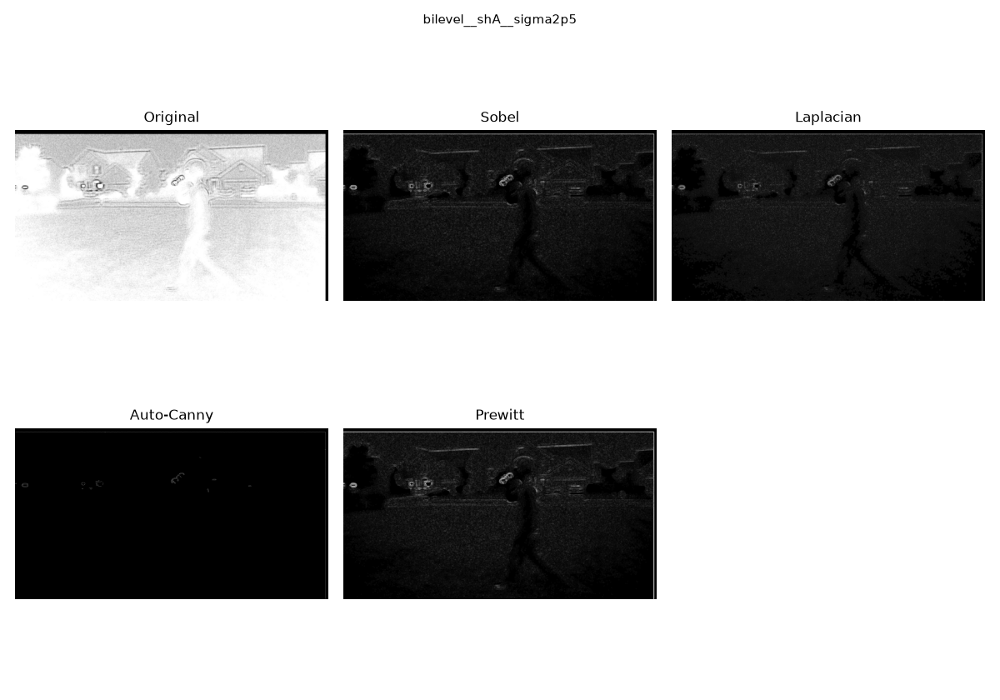
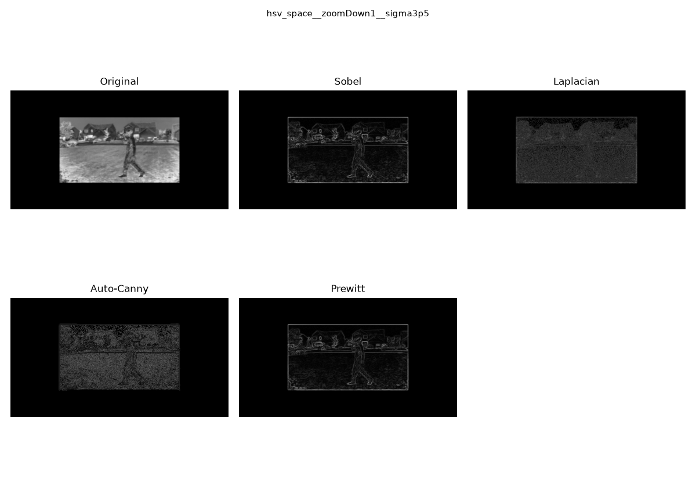
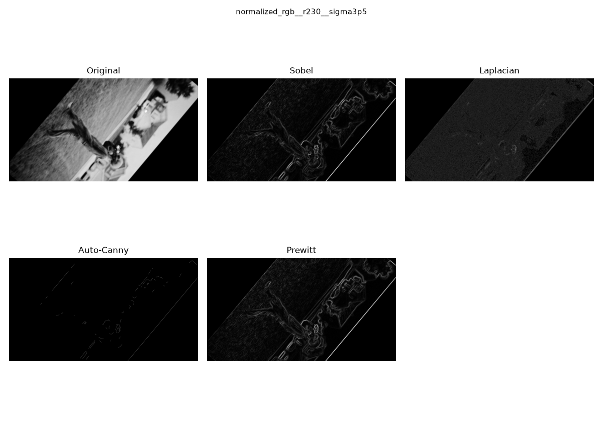
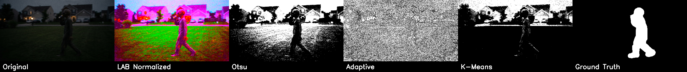

# CS 898BA - Homework One

Sricharan Cherepally – C986X996

## What this project does

Given one input image, this codebase runs a sequence of image analysis
operations using Python and OpenCV: per-channel pixel statistics, color
space conversions (HSV / LAB / HLS), contrast normalization via histogram
equalization, geometric warps (rotation / translation / scaling / shear),
Gaussian smoothing across several sigma levels, and four boundary/edge
detection operators (Sobel, Laplacian, an auto-thresholded Canny, and a
manually implemented Prewitt operator).

## Getting set up

```
pip install -r requirements.txt
```

Place your input image inside `data/input/`. The original assignment image
is not checked into this repository - it must be downloaded separately from
the link provided in the assignment instructions.

## Running the pipeline

Stage 2 (must run first):
```
python src/part2_processing.py --image data/input/YOUR_IMAGE.jpg
```
Produces `outputs/stage2/`:
- `source_statistics.json` - per-channel statistics for the original image
- 7 base representations (source, mono, bilevel, hsv_space, lab_space, hls_space, normalized_rgb)
- `warped/` - 14 geometrically transformed images
- `smoothed/` - 147 Gaussian-smoothed images (7 sigma levels x 21 images)

Stage 3:
```
python src/part3_edges.py --group 0
```
`--group` selects which of the 4 random 42-image partitions to analyze (0-3).
Produces `outputs/stage3/`:
- `boundaries/` - the grayscale input plus 4 boundary-detected versions for
  each of the 42 images in the chosen group (210 images total)
- `figures/` - 6 randomly selected comparison grids for inclusion below

## Implementation notes

`src/part2_processing.py`
- Statistics are computed per-channel (mode found via frequency counting
  rather than a statistics library call) and saved as JSON.
- The binary image uses adaptive (local) thresholding rather than a single
  global threshold, so it responds to local contrast rather than one
  whole-image cutoff.
- Histogram equalization on the V channel is implemented manually (building
  the histogram, computing the cumulative distribution, and remapping pixel
  values), rather than calling a built-in equalization function.
- Gaussian smoothing lets OpenCV derive the kernel size automatically from
  each sigma value.

`src/part3_edges.py`
- Partitioning uses a NumPy random permutation with a fixed seed, so the
  4 groups are reproducible from run to run.
- The Canny step automatically derives its lower/upper thresholds from the
  image's median intensity instead of using fixed constants.
- Prewitt is implemented from scratch with manual convolution kernels, since
  OpenCV doesn't provide one natively.

## Results

### Original image statistics 
| Channel | Min | Max | Average | Median | Mode | Skewness | Range | Std Dev | Variance | 
|---|---|---|---|---|---|---|---|---|---| 
| Blue | 0 | 255 | 21.83 | 10 | 4 | 1.68 | 255 | 26.23 | 687.99 | 
| Green | 0 | 255 | 24.64 | 16 | 10 | 1.76 | 255 | 22.23 | 493.96 | 
| Red | 0 | 255 | 20.61 | 12 | 4 | 2.11 | 255 | 22.46 | 504.26 | 

All three channels span the full 0-255 range but have averages and medians well below the midpoint (around 20-25 out of 255), with strongly positive skewness (1.68-2.11). This is consistent with a dark, low-light photo where most pixels are concentrated in the shadows, with a smaller number of much brighter pixels (highlights, lights, reflections) pulling the distribution's tail to the right. The Red channel is the most skewed and has the lowest average, while Green has the highest average of the three, suggesting the image's brighter regions lean slightly toward green/neutral tones rather than red. 

### Effect of increasing the smoothing sigma 

Looking across the sampled images at different sigma levels, the lower values (1.5-2.0) preserve enough structure that the person and background houses/cars remain clearly identifiable, with edges still sharp enough for Sobel, Prewitt, and even Canny to pick up real detail (see the sigma1p5 and sigma2p0 examples below, which look nearly identical to each other - at this range the extra half-step of blur barely changes what's detectable). By sigma 2.5, fine texture starts to disappear and edge detectors begin returning noticeably sparser results, particularly Canny. At sigma 3.5, the blurring is heavy enough that even Sobel and Prewitt only recover a rough silhouette rather than real detail, and Canny's output becomes almost entirely empty in several cases. Overall, sigma in this dataset acts as a fairly sharp cutoff for Canny's usefulness specifically - it degrades faster than the other three methods as blur increases. 


### Edge detection comparison 













Across these six examples, Sobel and Prewitt were consistently the most reliable. They produced clear, recognizable outlines of the person and background houses in every single case, including the heavily blurred and geometrically distorted versions (rotated, sheared, scaled down), and the two operators look almost identical to each other throughout, which makes sense given how similar their underlying gradient kernels are. 

Laplacian performed noticeably worse on the more heavily preprocessed images. On the scaled-down (zoomDown1, sigma 3.5) and heavily rotated (r230, sigma 3.5) examples, its output is mostly fine-grained noise rather than a clean outline, since Laplacian's second-derivative calculation is inherently more sensitive to noise than a first-derivative method like Sobel. On the least-blurred examples (sigma 1.5-2.0), it still produced a usable but visibly dimmer and grainier result than Sobel or Prewitt. 

Canny was the most inconsistent of the four. On the lightly blurred, contrast-normalized images (sigma 1.5 and 2.0), it actually performed quite well, returning clean and fairly complete edges for the person, houses, and cars. But on every more heavily processed example - the binarized image, the heavily blurred scaled-down image, and the heavily rotated image at sigma 3.5 - Canny's output collapsed to almost nothing, often just a faint fragment of the strongest edge (typically the image's own warp boundary) with the rest of the frame coming back completely black. This lines up with how Canny works: it depends on a clear gradient peak to cross its threshold, and once an image has been blurred and warped enough, that peak gets washed out faster than it does for the gradient-magnitude approach Sobel and Prewitt use. 

Taking all of this together, Sobel (tied closely with Prewitt) was the most useful and consistent edge detector for this specific image set, precisely because this dataset includes so many heavily preprocessed variants (blurred, warped, binarized, rescaled). Canny's reputation as the "best" general-purpose edge detector did not hold up here - its strong performance was limited to the least-altered images, and it broke down the most under the kind of heavy preprocessing this assignment specifically generates.


## Homework Two: Image Segmentation

### Multi-channel normalization

Rather than equalizing a single channel as in Homework One (which normalized
only the V channel of HSV), this assignment splits the source image into its
LAB components and equalizes the L, A, and B channels independently before
merging them back into a color image. LAB was chosen specifically because L
isolates lightness from color, which matters for a doorbell-camera image
shot under uneven, low-light conditions - equalizing L alone corrects
brightness contrast, while independently equalizing A and B additionally
recovers faint color-channel detail that a lightness-only pass would leave
untouched.

### Quantitative comparison (IoU / Dice against ground truth)

| Method   | IoU    | Dice   |
|----------|--------|--------|
| Otsu     | 0.0368 | 0.0710 |
| Adaptive | 0.0916 | 0.1678 |
| K-Means  | 0.0230 | 0.0450 |

All three methods score low against the manually-traced ground truth, which
is itself a meaningful result given how dark and low-contrast the source
image is - but the relative ordering is informative. Adaptive thresholding
came out ahead of both Otsu and K-Means by a clear margin, which lines up
with what the masks show visually.

### Qualitative analysis

**Otsu's global thresholding** performed the worst of the three. Otsu
assumes the image splits cleanly into one bright group and one dark group,
but in this image the figure and the surrounding shadowed lawn/background
are both dark - so Otsu's single global cutoff lumped the person in with
the background shadow instead of separating him out. The resulting
foreground extraction kept the houses, sky, and lawn rather than the
figure, which is the opposite of what was needed.

**Adaptive thresholding** handled the same low-light conditions better
because it recomputes a threshold locally for each neighborhood rather than
using one global cutoff. This let it pick up on local contrast around the
figure's outline even where the overall scene was dark. The tradeoff is
noise: because adaptive thresholding reacts to small local intensity
variations, the output is considerably grainier than Otsu's, with the
sensor noise in the original low-light shot showing up as scattered
speckling across the whole mask, especially in the lawn and sky regions.
Even with that noise, it preserved more of the figure's actual silhouette
than either of the other two methods, which is reflected in its higher
IoU and Dice scores.

**K-Means clustering** in HSV space, with K selected automatically via
silhouette score, chose K=3 (silhouette score 0.5184, beating K=4 at 0.4827
and K=5 at 0.5046). However, the resulting clusters grouped the figure's
dark clothing together with the shadowed rooftops and architectural
features in the background, rather than isolating the person as his own
cluster - both share similar low-saturation, dark-value HSV characteristics
under these lighting conditions. This produced the lowest IoU of the three
methods, since the selected "figure" cluster mask captured house structure
in addition to (and in places instead of) the person.

**Effect of color normalization compared to Homework One's raw results:**
Equalizing all three LAB channels independently visibly brightened and
added contrast to the normalized image compared to the original, and
compared to Homework One's single-channel (V-only) normalization, the
LAB version preserves more separation between the figure and the
background in terms of raw pixel values. However, this normalization alone
was not enough to overcome the fundamental challenge for all three
segmentation methods: the figure and the background shadow/architecture
occupy a genuinely overlapping range of intensity and color values in this
particular photo. This suggests that intensity- and color-based
segmentation alone is insufficient for this image, and that a spatial or
edge-aware refinement step (e.g. combining the boundary detection from
Homework One with these masks, or adding a connected-component filter)
would likely be necessary to cleanly isolate the figure in future work.

### Comparison figure


